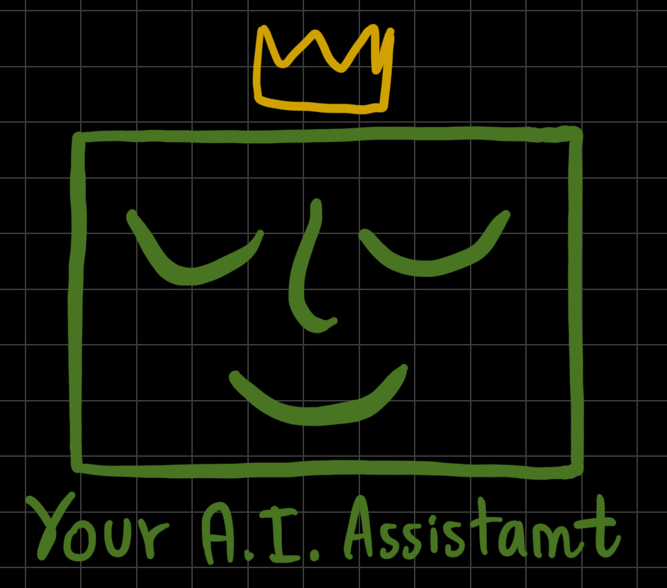
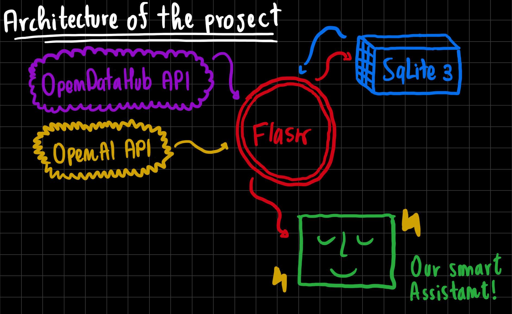

# ChargeBot



## Intro

This is ChargeBot, an end-to-end Docker application that aims to provide a useful recreational opportunity for users waiting for their electric vehicle to be fully charged. It uses up-to-date data from the [Open Data Hub (ODH)](<https://opendatahub.it>) to optimise our OpenAi GPT-4o bot through Retrieval-Augmented Generation (RAG) in order to provide suggestions based on the user's preference, availability of events, activities, weather and distance between the user and the point of interest. The application uses the Flask framework to provide optimal interaction.

## Installation

Skip to the usage part if you only want to see the product online.
If you really want to test our web service locally, maybe to experiment yourself with our codebase or just to make some styling adjustments
ChargeBot installation involves building custom images for its Python processor components (that will be runned next inside a container).

Clone this repository and copy `.env.example` into `.env`, possibly editing it (just creating `.env` is enough):

  ```bash
  git clone https://github.com/giusber2005/chargeBot.git
  cd chargeBot
  cp .env.example .env
  ```

## Usage

You can see our demo for the application live on [this link](<https://chargebot-2x2k.onrender.com>) if you don't want to install it on your local machine.

If instead you've already installed it on your machine (thank you!), you can follow this step to try it:
(Notice that this chatBot will be used inside charging station, what you see on your laptop is just a demo!)

In a terminal, use Docker Compose to start or stop all the required components.

  ```bash
  docker compose up                        # to start the application
  docker compose down -v --remove-orphans  # to stop the application
  ```

Once the application is up and running, you can access the chat and start your query by opening your web browser and going to <http://localhost:5000>.

Some techical observations
- You will be presented with a flask web interface showing the chat, the platform is already designed to work on mobile too.
- The data is updated at the first prompt retrieving the daily atraction and the weather forecast for the next three hours.
- Explore the different options by continuously chatting with the bot and specifying all your needs.


The figure shows the application architecture in terms of components and data flow (solid links):

The application uses current data from the [Open Data Hub](<https://opendatahub.it>). Loads the :
-Weather forecast for the next 3 hours
-Activity based on the season
-Events happening during the day
-Distance between EV charging station and POI

The information is collected and stored to create a dataset used to run RAG with the GPT-4o model.
The props for the LLm are tailored so that the models are limited in the hallucination, and do not drive away from the conversation, but still mantain a polite approach to the conservation by giving short responses to off-topic questions.
The conversation is stored in a SQlite database to further fine-tune the model with enough user preferences.

## Licence

MIT
